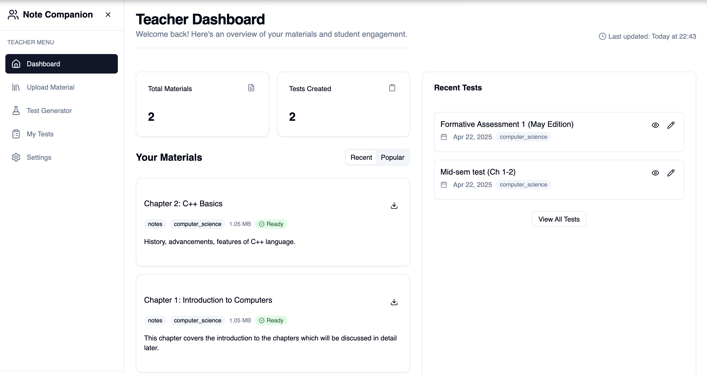

# NoteNinja: Educational Content Management Platform

NoteNinja is a comprehensive educational platform designed to help teachers create, organize, and distribute educational content, including automated test generation from study materials. The platform leverages AI to transform teaching and learning experiences.



## 🚀 Features

### 👨‍🏫 For Teachers
- **Intelligent Test Generation**: Automatically create tests from uploaded materials using Gemini AI
- **PDF Generation**: Create professional-looking test PDFs for distribution
- **Content Management**: Upload, organize, and track teaching materials
- **Role-Based Dashboard**: Dedicated teacher interface with powerful tools

### 👨‍🎓 For Students
- **Material Access**: Browse and download educational materials
- **Note Taking**: Create and manage study notes
- **Flashcards**: Create flashcards for effective studying
- **Revision Planning**: Schedule and track revision activities

## 🔧 Tech Stack

### Frontend
- **Framework**: [Next.js 15](https://nextjs.org/) (App Router)
- **UI Library**: [React 19](https://react.dev/)
- **Styling**: [Tailwind CSS](https://tailwindcss.com/) + [shadcn/ui](https://ui.shadcn.com/)
- **PDF Generation**: [@react-pdf/renderer](https://react-pdf.org/)
- **Form Handling**: [React Hook Form](https://react-hook-form.com/) + [Zod](https://zod.dev/)

### Backend
- **API Routes**: Next.js API routes
- **Authentication**: [NextAuth.js](https://next-auth.js.org/) (now Auth.js)
- **Database ORM**: [Prisma](https://www.prisma.io/)
- **Database**: PostgreSQL (via [Supabase](https://supabase.com/))

### AI Integration
- **AI Provider**: [Google Gemini AI](https://ai.google.dev/) for test generation
- **Content Parsing**: PDF parsing and content extraction using:
  - [pdf-parse](https://www.npmjs.com/package/pdf-parse)
  - [pdf2json](https://www.npmjs.com/package/pdf2json)
  - [pdfjs-dist](https://www.npmjs.com/package/pdfjs-dist)
- **Markdown Processing**: Content transformation using [unified](https://unifiedjs.com/), [remark](https://remark.js.org/), and [rehype](https://github.com/rehypejs/rehype)

## 🛠️ Installation and Setup

### Prerequisites
- Node.js 18+ and npm/yarn
- PostgreSQL database
- Google Gemini API key
- OAuth credentials (Google, GitHub) for authentication

### Installation Steps

1. **Clone the repository**
   ```bash
   git clone https://github.com/yourusername/noteninja.git
   cd noteninja
   ```

2. **Install dependencies**
   ```bash
   npm install
   # or
   yarn install
   ```

3. **Set up environment variables**
   Copy the `.env.example` file to `.env` and fill in the required values:
   ```bash
   cp .env.example .env
   ```
   
   Required environment variables:
   - `DATABASE_URL`: Your PostgreSQL connection string
   - `NEXTAUTH_URL`: The base URL of your application (e.g., http://localhost:3000)
   - `NEXTAUTH_SECRET`: Secret for NextAuth (generate with `openssl rand -base64 32`)
   - `GOOGLE_CLIENT_ID` and `GOOGLE_CLIENT_SECRET`: For Google OAuth
   - `GITHUB_CLIENT_ID` and `GITHUB_CLIENT_SECRET`: For GitHub OAuth
   - `GEMINI_API_KEY`: For Google Gemini AI integration

4. **Set up the database**
   ```bash
   npx prisma migrate dev
   # or
   yarn prisma migrate dev
   ```

5. **Start the development server**
   ```bash
   npm run dev
   # or
   yarn dev
   ```

6. **Access the application**
   Open [http://localhost:3000](http://localhost:3000) in your browser

## 📄 Project Structure

```
noteninja/
├── app/                  # Next.js App Router
│   ├── api/              # API routes
│   ├── auth/             # Authentication pages
│   ├── teacher/          # Teacher-specific pages
│   │   ├── dashboard/    # Teacher dashboard
│   │   ├── test-generator/  # AI test generation
│   │   └── tests/        # Test management
│   ├── student/          # Student-specific pages
│   └── role-selection/   # Role selection page
├── components/           # Reusable UI components
│   ├── ui/               # Base UI components (shadcn/ui)
│   ├── test/             # Test-related components
│   └── layout/           # Layout components
├── lib/                  # Utility functions and shared logic
│   ├── generated/        # Generated Prisma client
│   └── auth.ts           # Authentication configuration
├── prisma/               # Database schema and migrations
│   └── schema.prisma     # Prisma schema
└── public/               # Static assets
```

## 📚 Database Schema

NoteNinja uses a PostgreSQL database with the following main entities:

- **User**: User accounts with role-based access (teacher/student)
- **Upload**: Teaching materials uploaded by teachers
- **Test**: Tests generated from materials
- **Note**: Student notes
- **Flashcard**: Study flashcards
- **Revision**: Revision planning

## 🔐 Authentication

The application uses NextAuth.js for authentication with the following providers:
- Google OAuth
- GitHub OAuth
- (More can be added in `lib/auth.ts`)

## 🧠 AI Test Generation

NoteNinja uses Google's Gemini AI to analyze teaching materials and generate tests automatically:

1. Teachers upload study materials (PDF, documents)
2. System extracts and processes the content
3. Gemini AI analyzes content and generates appropriate test questions
4. Teachers can customize and export tests as PDFs

## 🚀 Deployment

### Deploying to Vercel (Recommended)

```bash
npm install -g vercel
vercel login
vercel
```

### Alternative Deployment Options

The application can also be deployed to:
- Netlify
- Railway
- AWS Elastic Beanstalk
- Docker containers

## 🧪 Testing

```bash
# Run tests
npm test

# Run linting
npm run lint
```

## 🤝 Contributing

Contributions are welcome! Please feel free to submit a Pull Request.

1. Fork the repository
2. Create your feature branch (`git checkout -b feature/amazing-feature`)
3. Commit your changes (`git commit -m 'Add some amazing feature'`)
4. Push to the branch (`git push origin feature/amazing-feature`)
5. Open a Pull Request

## 📜 License

This project is licensed under the MIT License - see the LICENSE file for details.

## 🙏 Acknowledgements

- [Next.js](https://nextjs.org/)
- [React](https://reactjs.org/)
- [Tailwind CSS](https://tailwindcss.com/)
- [shadcn/ui](https://ui.shadcn.com/)
- [Prisma](https://www.prisma.io/)
- [NextAuth.js](https://next-auth.js.org/)
- [Google Gemini AI](https://ai.google.dev/)
